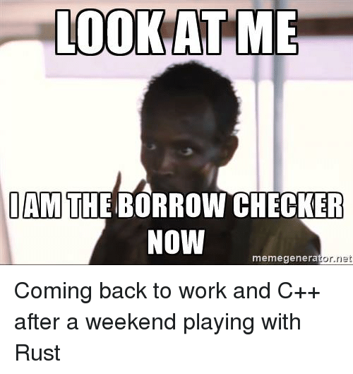

# Borrow-Checker
Is a fairly new concept of memory usage which is a fundamental part of the Rust programming language. 
It forces you to manage the ownership which allows you on the other side to make memory saftey guarantees without
relying on a garbage collector.

Most languages are using a gabarge collector which automaticly frees memeory when it is not anymore in use which
abstracts a lot of complexity for many developers, but there are some use cases where detailed memory controll can be a huge benefit. Let's first talk about the stack and the heap.

## The Stack & The Heap
When we allocate memory we can make use of either the stack or the heap both memories
differ from each other and are usefull for diffrent kind of data.

### The Stack
The data stored on the stack has a fixed sized by that I mean how many bytes of data 
we can store into the stack. Also the stack follows the first in & first out principle.
The stack is ideal for data with a know byte size. Like integers, charackter, boolean.

### The Heap
The Heap can hold data oof any arbitrary size therefore the computer needs to find a chunk of memory
which is large enough so it can store the desired data. The search for these memory chunks can be time consuming. Collections, Lists are usallly stored inside the heap.

### Garbage Collection 
In garbage-collected languages, you don’t need to worry about what goes on the stack and what goes on the heap. Data that goes on the stack gets dropped once it goes out of scope. Data that lives on the heap is taken care of by the garbage collector once it’s no longer needed.

### Manual Memmory Allocation
In languages such as C, on the other hand, you need to manage memory yourself. Where you might simply initialize a list in higher-level languages, you need to manually allocate memory on the heap in C. And when you’ve allocated memory, you should also free the memory once you’re done with it to avoid memory leaks. But be careful: memory should only be freed once.

### Rust Ownership
Rust’s ownership model feels like something in between. By keeping track of where data is used throughout the program and by following a set of rules, the borrow checker is able to determine where data needs to be initialized and where it needs to be freed (or dropped, in Rust terms). It’s like it auto-inserts memory allocations and frees for you, giving you the convenience of a garbage collector with the speed and efficiency of manual management.

